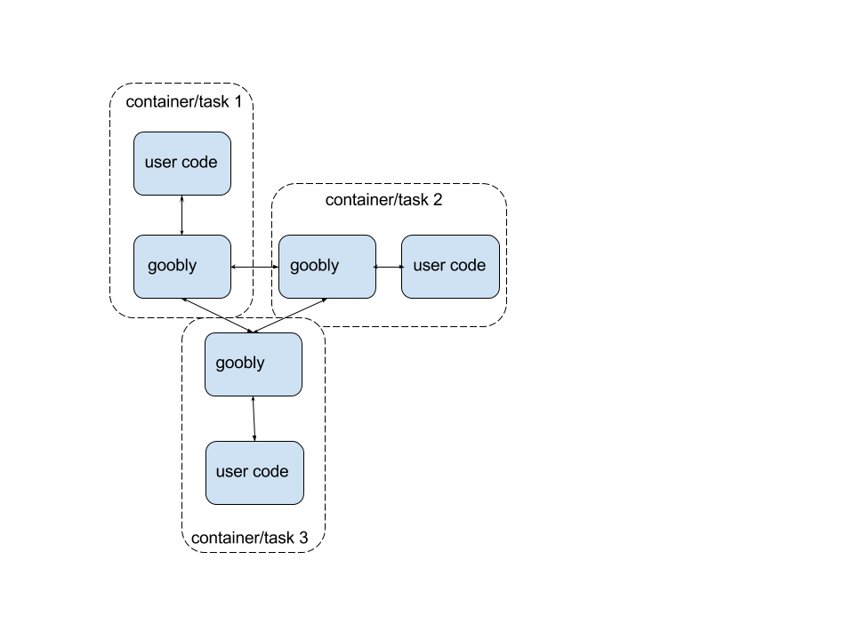

# Goobly:
## Experimental approach to stream processing.

Let's start with an example from spark.

```scala
    val textFile = spark.textFile("hdfs://...")
    val counts = textFile.flatMap(line => line.split(" "))
                     .map(word => (word, 1))
                     .reduceByKey(_ + _)
    counts.saveAsTextFile("hdfs://...")
```

This example is easy to break into a few mental boxes/functions.

```
[source] -> [sentence splitter] -> [emitting word] -> [aggregating results] -> [save]
```

Let's delete the glue and leave only the procesing functions:

```
 [sentence splitter] -> [emitting word] -> [aggregating results]
```

Now, let's break these functions into 2 camps. Those that need state,
and those that don't

Stateless:

```scala

  // stateless funcs
  ...
  .flatMap(line => line.split(" ")) // sentence splitter
  .map(word => (word, 1))           // emitting word

```

Stateful:

```scala
  .reduceByKey(_ + _)

```

## Googly's Intended Case

Stateless aggregations are easy to scale. As long as your routing layer can handle redistribution of work
via consistent hashing (e.g.: 256 vnodes like cassandra or 3 buckets like riak), you can keep adding
machines to increase the aggregation throughput. It is thus very desirable to be able to use only stateless
computations.

The pseudo code is relatively simple:

```python

   for all downstream subscribers: do
     tell parents to update routing layer # (scale up/down)
     spin up tasks
   done

```

However, statefull operators are much more difficult to scale

```python

   for all downstream subscribers: do
     pause work
     send water mark
     checkpoint state
     tell parents you're done suspending work
     scale up/down
   done

```

Goobly is the component that would make checkpointing state trivial.

Here is what it would look like in practice:



# BUT WHYYYYYY, for the love of god!
### How do I love 'state', Let me count the ways:


1. Depending on a datastore requires global availability of that datastore
2. It requires you to modify your code, semantics of the biz logic to match
the guarantees of the datastore.
3. When the statsotre is down, the streaming engine has no clue about it and
your supervision strategies no longer make sense.
4. In a world where datacenters are abstracted out as numbers (CPU, Mem, Disk...)
It makes absolutely no sense not to take advantage of it.
5. Recovery of one operator's state is MUCH cheaper than the recovery of a
database node. Consider that you only have to recover the word counts.
6. All stream processing engine have a temporal aspect to them. That is,
after processing data and storing state for the last month, it makes little
sense to keep it on disk, because hopefully you have a materialized view
to represent the final results.
7. Timers and timing operations should be persistent!!!! Reasoning about time
on a strem processing engine is hard AF. Are you going to process them
on event time or system time.


# Let's break it down.
<code>

</code>

## 1. Global availability of a datastore

I'm a _YUGE_ fan of [Google MillWheel](http://research.google.com/pubs/pub41378.html).
Tyler and team inspired me to start [concord](concord.io).

They key insight here is that they didn't have to worry about replicating state
per message/tuple as they already had an internal system to handle this. When a
downstream subscriber of a 'topic/stream' registers with the system, you
effectively get a tailing iterator for the table(materialized view) of the
stream at it's current offset. Any computation from that moment forward knows
your offset into the table and will be correct and stateful per *message*.

In effect this architecture did what [Samza](http://samza.apache.org/)
did with a few [Kafka](http://kafka.apache.org) brokers. Push the
replicated state machine complexities to other systems that are specialized and
very good at it like Kafka/Spanner/BigTable.

In fact if you look at [Cask](http://blog.cask.co/tag/streaming/),
they did the exact same thing with [HBase](http://hbase.apache.org).
[Concord](concord.io) in it's currrent implementation does something different,
but we found that in practice this is a good system. It make's people feel good
if you use/connect to a 'known' datastore that users know how to operate.

The obvious failure with this approach is that welp... so many. The gist of it
all is that you end up depending on a LOT of external factors. Here is a few:

* Front end servers requesting data from the datastore
* Map Reduce jobs crunching numbers
* Data center recovery and failure bring to what equates to an operational
outage by dumpping data faster than the datastore can handle (as is the case
with HBase for example - if you dump data too fast, you have to manually
partition table because the parition code gets kicked off at an interval. This
causes the region servers to get overloaded during a data center recovery)

In fact, this is such a problem that for larger companies that I've consulted
with you 'pace' (dump x recods in y time) the recovery to play nicely with
[Cassandra](http://cassandra.apache.org), HBase, etc.

This is not a big deal with Google - and I am assuming - because they have
virtually unlimited hardware. Not to mention amazing site reliability personel.

However for most businesses it is *not* practical to run a sperate HBase cluster
per system. That is, one for the front end servers, one for your streaming
framework, etc. Note that in large operations of
[Apache Storm](http://storm.apache.org/) because of the hartbeat mechanism being
stored in Zookeeper (and their original Kafka consumer implementation)
it would be the normal case to have a sperate zookeeper
cluster *just* for storm.


## 2. Your code HAS to take advantage of the capabilities of your datastore

If you don't you are missing out. The datastore of your choice made
decisions for you. Replication, safety guarantees, RPC's, Serialization,
quering interface, etc. Use them! Specially when it comes to a stremaing
service, you will need to squish every single ounce of performance of every
database. In fact, most will work against your use case:

Temporal manipulations of data that are by definition lopsided. Either becase
in practice one of your customers is *always* bigger than the others, usually
by orders of magnitude. Or because you are using it to reason about timely
operations which means that the server servicing those requests is doing all
of the work for that time window.

If you don't partition your data (user_id, site_id, etc) you risk and in every
case/datastore I've used in productionn your crash them. If you think
abstractly about what you are doing, datastores often act as 2 separate systems.

They act as your queueing system as well as your key-value system.

An example is when I was working with early versions of [Storm](storm.apache.org)
I used the time qualifier/version on HBase to act as my versioning. I would then
lower the versions of HBase to 2 and use Trident's transactional (often buggy)
semantics to reason about money operations.

## 3. Because of the interface to the world is an IP:PORT

Streaming engines are usually at odds with Globally visible datastores. Frist,
well, they need to be globally visible as far as the streaming operators are
conerned. Second, the streaming engine has absolutely zero clue wether the
datastore is down or not.

This manifests in the API of the programmer. Either the programmer has explicit
access to tell the framework to *chill* for a second, or it throws an exception
and the framework supervision strategies kick.

It's not too hard to learn that this is a broken abstraction. It is first broken
because an exception is not enough to know what to do. It's broken because you
want to (as a framework author) unify the failure semantics for the programmer
so that he can reason about them soundly. The natural thing to do in this case
as far as a framework is concerned is to wait for a littlebit, try to re-spawn
the task on a different machine and do this up to N times. If all else fail,
go back and watch a movie. Come back on Monday and realize that you are missing
50 thousand dollars from your ad spend because the region server handling the
requests was down, so only *part* of your topology is down.

## 4. Mesos/YARN - Obvi, Mesos! (durability primitives)

This is very biased opinion and hoping to get feedback here from you.

Frist, I've written 5 frameworks on top of Mesos. 3 in scala/java and 2 in C++.
I absolutely love the abstractions of an scheduler. It let's me elastically
spawn minions to do real work and have pluggable supervision strategies. It
gives me a single place to reason about how hardware relates to software.

Say that you wanted to colocate your ad servers with your redis instances.
Boom! you can now make that an invariant on your task launching DSL.

Recently as part of [concord](concord.io) we are working to guarantee after
launching tasks that the colocation of your services make sense. If you
still have space in the machine, given some minor constraints of host
diversification, place them in the same machine - less work for the network
, etc.

Now, why is mesos a good abstraction for goobly? Simple: with the 24 release,
(i think earlier too) you now have access to durable and persistent volumes.
This can potentially reduce the downtime of a failure as it separates execution
(CPU & Task execution) from storage (NAS or whatever). So even if one of
your tasks fails, you can easily recover from failure with minimal downtime.


## 5. [Kyle Kingsbury](Aphyr.com) has a cruel aparatus - Empirical failures of datastores FTW
## 6. Temporal nature of streams == specialized replicated state machines
## 7. Time sucks.
## 8. Bonus: what about other state machine algos? or even snapshotting algos?
0. I've read a few in details (read the source code for implementations + papers)
1. ISR(kafka)
2. ZAB(Zookeeper)
3. Gossip(Cassandra)
4. Chained-RPC(HyperDex)
5. Raft(LogCabin/Kudu)
6. Upstream-Backup(Mention Raul's/Neha's system, oii forgot the name)

I've also looked at view-stamped replication among others, but don't know of
any open source impl

### TODO(agallego):
1. bring all the refs to samza, apex, millwheel, flink, etc
2. Finish the breakdown
